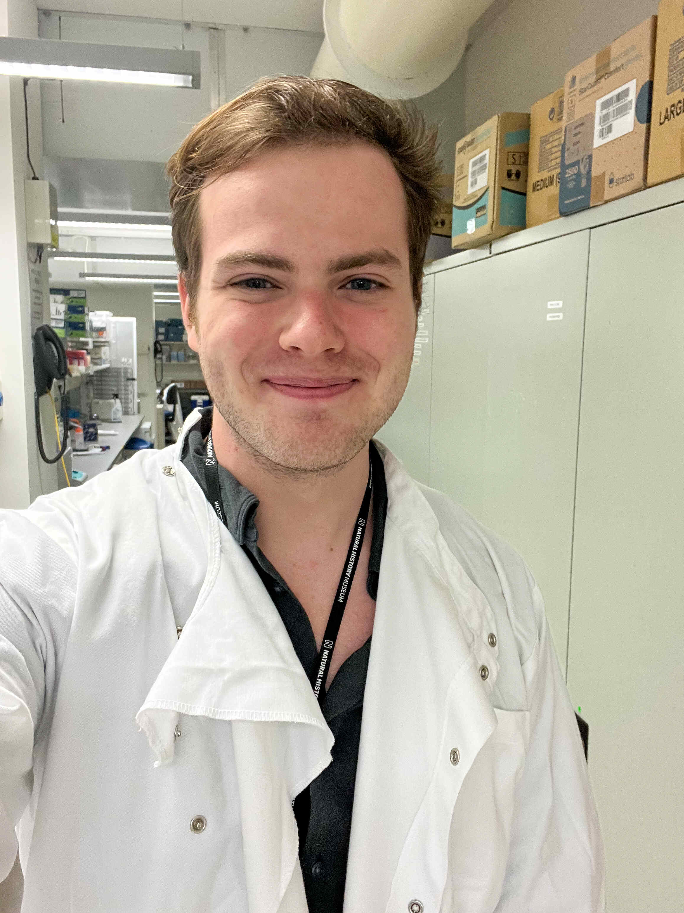

  

  

  

## Hi, I'm Andy!

I'm a PhD student at the UCL Genetics Institute. I'm part of the [Molecular and Cultural Evolution Lab](https://www.ucl.ac.uk/biosciences/gee/molecular-and-cultural-evolution-lab) where I'm lucky enough to be supervised by [Prof Mark Thomas](https://www.ucl.ac.uk/biosciences/people/clone-mark-thomas) and [Dr Adam Rutherford](https://profiles.ucl.ac.uk/45497). I'm really passionate about crossing boundaries between fields and interdisciplinary research. Hopefully, you can see a little bit of this below!

### About me

My research focuses on how theoretical models in population genetics shape current research in the field. This involves combining evolutionary genetics and historical study to scrutinise the history of the models' assumptions, including how they influence work in the field today, as well as developing new statistical approaches to better reflect real-world genetic variation.

Before starting my PhD, I completed an MRes in Biodiversity, Evolution and Conservation at UCL, where I completed two projects at partner institutions:

🐘 At the Natural History Museum, I used thousand-year-old ancient DNA to investigate elephant evolution. It was great learning how to work with highly degraded DNA, both in the lab and bioinformatically. This was also my first introduction to historical research, building on the story of the objects from their DNA.

🛰️ At the Zoological Society of London (ZSL), I aimed to increase the accuracy of global biodiversity loss models. Our goal was to improve the quality of their land use data by combining satellite imagery with deep learning. This was a great introduction to applying computer vision machine learning techniques to ecology.

I studied for my BSc in Biological Sciences (Evolutionary Biology) at the University of Edinburgh. Where despite the trials of COVID learning and Intro to Organic Chemistry, I found I loved research!

Feel free to explore my research or get in touch if you're interested in evolutionary genetics, science history, or just want to chat!

  

