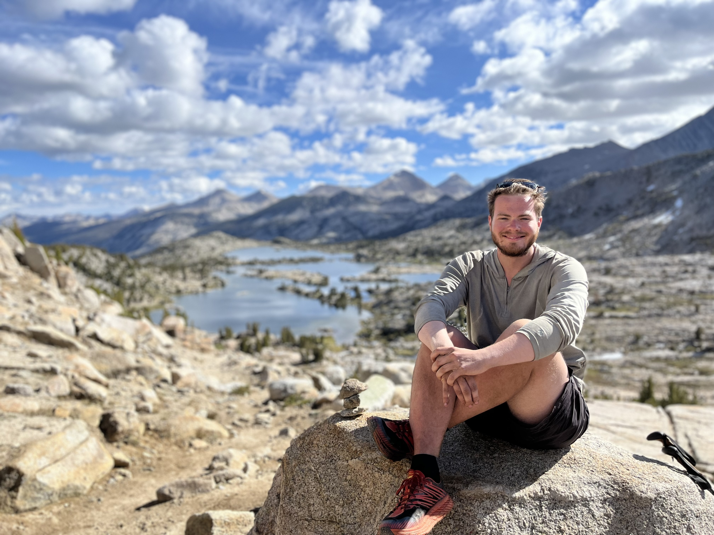

I love nature, so try to spend as much of my spare time as possible outdoors. Getting out in nature and doing things I find challenging isn't just good for the mental health but is great for developing skills. Here's a glimpse into life beyond academia:

## Hiking and Cycling very slowly

I love a good long distance adventure. I've been lucky enough to complete two 500 mile solo section hikes of the Pacific Crest Trail, where carrying a 40 lb pack in 40 degree heat through the desert was definitely character building. This summer, I also cycled the length of the UK self-supported (sleeping in the odd hedge along the way).

  
  

## Diving

I've recently qualified as a divemaster and trained in technical diving, so am spending more and more of my free time underwater. However, I have yet to convince my supervisors of the need for a field season diving on deep technical wrecks in the Caribbean.

  
  

