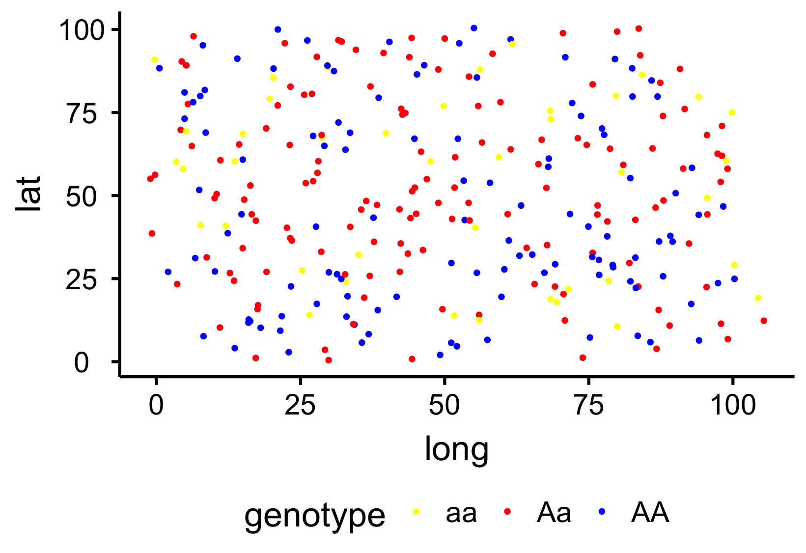
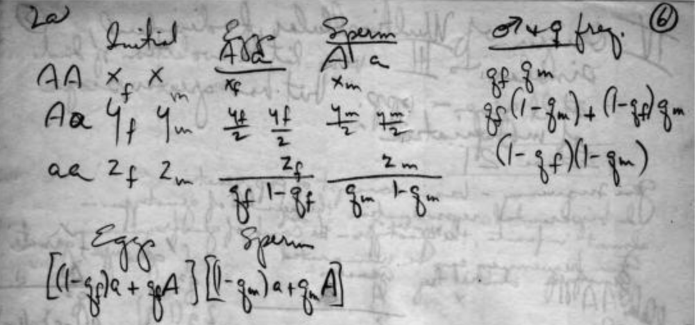
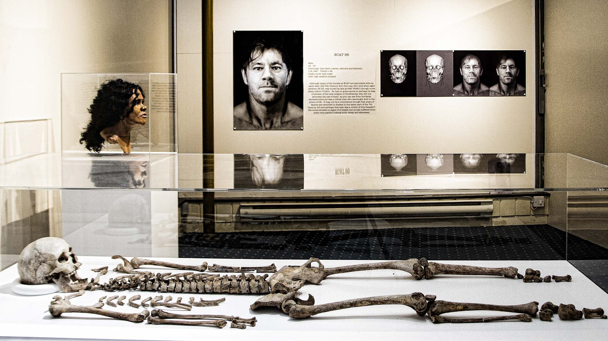

## Population Genetics Modelling

{.in-text-image}

Many of the models in Population Genetics are based around the panmictic population concept. In other words, often, contain assumptions of random mating, infinite population size, no migration etc. However, in nature, these assumptions are rarely the case. I'm interested in developing new models which move away from these, such as modelling populations in more continuous space.

<!-- Add some space between sections -->

## History of Science

{.in-text-image}

It's fascinating to be able to study the history of a field, not as a professional historian, but as a practitioner in the field. This work is crucial in understanding why assumptions were made in theoretical work, as these decisions often reflect the times or world-view of those formulating the models, and may not be necessary to make today.

<!-- Add some space between sections -->

## Ancient DNA and Evolution

{.in-text-image}

I continue to work with the Ancient DNA Lab at the Natural History Museum London where I get to apply some of these ideas around moving away from the traditional population concept in evolutionary genetics to real-world data.

<!-- Add some space between sections -->

